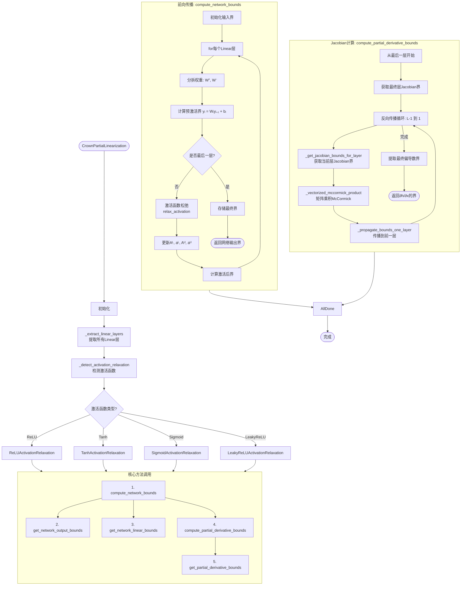
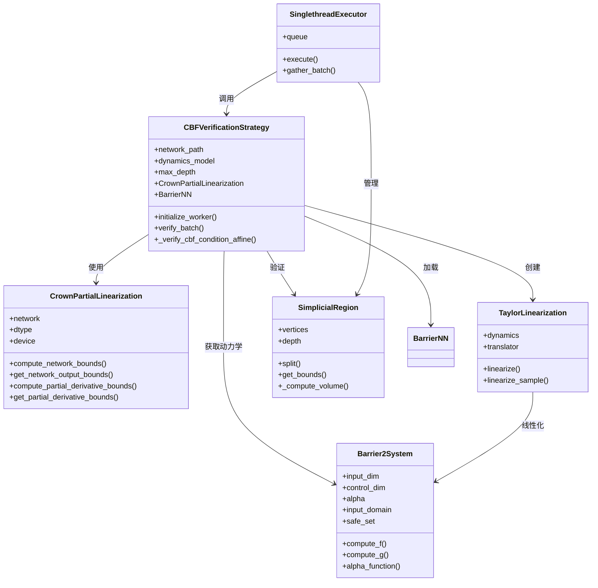
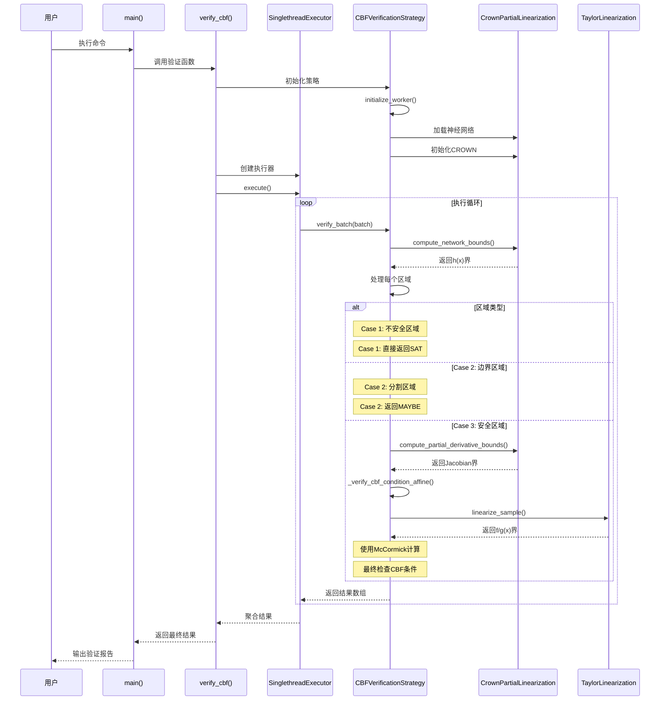
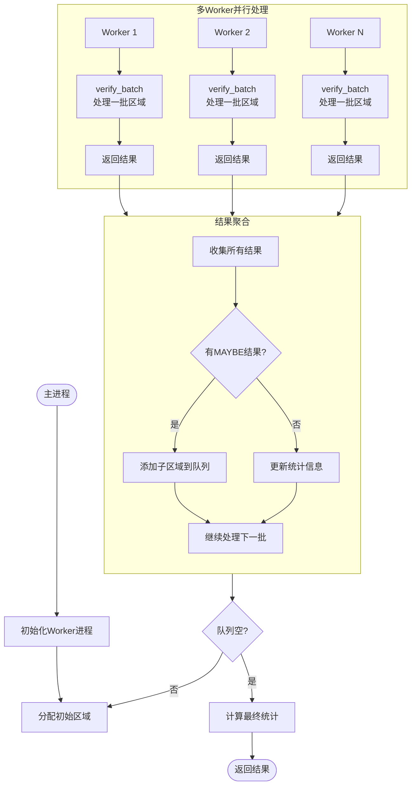

# CBF神经网络验证流程图

基于论文：**Scalable Verification of Neural Control Barrier Functions Using Linear Bound Propagation**

命令：`python3 experiments/barrier_certificate.py --system-type barr2 --verify --max-depth 13`

---

## 目录

1. [整体架构流程图](#整体架构流程图)
2. [主验证流程图](#主验证流程图)
3. [CBF条件验证详细流程图](#cbf条件验证详细流程图)
4. [CROWN线性界传播流程图](#crown线性界传播流程图)
5. [泰勒展开流程图](#泰勒展开流程图)
6. [区域分割流程图](#区域分割流程图)

---

## 整体架构流程图

```mermaid
flowchart TB
    Start([用户命令行]) --> Main[experiments/barrier_certificate.py<br/>main()]
    Main --> Init[初始化动力学系统<br/>Barrier2System]
    Main --> LoadModel[加载神经网络模型<br/>BarrierNN]
    Main --> CreateStrategy[创建验证策略<br/>CBFVerificationStrategy]
    CreateStrategy --> InitCROWN[初始化CROWN线性化器<br/>CrownPartialLinearization]
    Main --> CreateMesh[创建网格<br/>SimplicialMesh]
    Main --> CreateExecutor[创建执行器<br/>SinglethreadExecutor]

    CreateExecutor --> Verify[verify_cbf()]
    Verify --> Execute[executor.execute()]
    Execute --> VerifyBatch[verify_batch()]
    VerifyBatch --> VerifyCBFCond[_verify_cbf_condition_affine()]

    VerifyCBFCond --> CompDynBounds[compute_dynamics_bounds_taylor<br/>泰勒展开]
    VerifyCBFCond --> GetJacBounds[get_partial_derivative_bounds<br/>CROWN]
    VerifyCBFCond --> McCormick[Mccormick乘积松弛]
    VerifyCBFCond --> FinalCheck[最终验证检查]

    FinalCheck --> Result{验证结果?}
    Result -->|通过| SAT[SampleResultSAT]
    Result -->|失败| Split{_handle_split}
    Split --> SplitRegion[sample.split()]
    SplitRegion --> SubRegions[生成子区域]
    SubRegions --> Execute

    FinalCheck -->|无法验证| UNSAT[SampleResultUNSAT]

    SAT --> Agg[结果聚合]
    UNSAT --> Agg
    Agg --> End([返回结果])
```

**说明**：
- 绿色框：用户入口
- 蓝色框：主要初始化步骤
- 黄色框：核心验证算法
- 橙色框：结果处理
- 实线：正常流程
- 虚线：循环/递归

---

## 主验证流程图

```mermaid
flowchart TD
    Start([main()]) --> ParseArgs[解析命令行参数]
    ParseArgs --> SelectSys{系统类型?}

    SelectSys -->|simple2d| Sys1[Simple2DSystem]
    SelectSys -->|barr1| Sys2[Barrier1System]
    SelectSys -->|barr2| Sys3[Barrier2System]
    SelectSys -->|barr3| Sys4[Barrier3System]
    SelectSys -->|barr4| Sys5[Barrier4System]
    SelectSys -->|cartpole| Sys6[CartpoleSystem]
    SelectSys -->|hiord2| Sys7[HighOrd2System]
    SelectSys -->|hiord4| Sys8[HighOrd4System]
    SelectSys -->|hiord6| Sys9[HighOrd6System]
    SelectSys -->|hiord8| Sys10[HighOrd8System]

    Sys1 --> InitVerify
    Sys2 --> InitVerify
    Sys3 --> InitVerify
    Sys4 --> InitVerify
    Sys5 --> InitVerify
    Sys6 --> InitVerify
    Sys7 --> InitVerify
    Sys8 --> InitVerify
    Sys9 --> InitVerify
    Sys10 --> InitVerify

    subgraph InitVerify [初始化验证]
        direction TB
        V1[verify_cbf()] --> V2[CBFVerificationStrategy]
        V2 --> V3[initialize_worker()]
        V3 --> V4[加载.onnx/.pth模型]
        V4 --> V5[创建CrownPartialLinearization]
        V5 --> V6[保存到全局_LOCAL]
    end

    InitVerify --> CreateMesh[create_region_generator]
    CreateMesh --> CreateSimplicial[SimplicialRegionGenerator]
    CreateSimplicial --> InitMesh[SimplicialMesh初始化]
    InitMesh --> Delaunay[Delaunay三角剖分]
    Delaunay --> GetRegions[get_regions(0)<br/>获取初始区域]

    GetRegions --> CreateExec[创建执行器]
    CreateExec --> ExecType{执行器类型?}
    ExecType -->|single| Single[SinglethreadExecutor]
    ExecType -->|multi-thread| MultiThread[MultithreadExecutor]
    ExecType -->|multi-process| MultiProcess[MultiprocessExecutor]

    Single --> ExecuteLoop
    MultiThread --> ExecuteLoop
    MultiProcess --> ExecuteLoop

    subgraph ExecuteLoop [执行验证循环]
        direction TB
        E1[executor.execute()] --> E2[初始化worker]
        E2 --> E3[将初始区域放入LIFO队列]
        E3 --> E4[while队列为空?]
        E4 -->|否| E5[gather_batch<br/>获取一批区域]
        E5 --> E6[process_batch<br/>调用verify_batch]
        E6 --> E7[处理每个结果]
        E7 --> E8{有新样本?}
        E8 -->|是| E9[将新样本放入队列]
        E9 --> E4
        E8 -->|否| E4
        E4 -->|是| E10[计算统计信息]
    end

    ExecuteLoop --> PrintResults[打印验证结果]
    PrintResults --> End([结束])
```

**代码文件**：
- 主入口：`experiments/barrier_certificate.py:17-240`
- 验证函数：`lbp_neural_cbf/cbf/verify_cbf.py:40-231`
- 执行器：`lbp_neural_cbf/executors/single_thread_executor.py:9-163`

---

## CBF条件验证详细流程图

```mermaid
flowchart TD
    Start([verify_batch()]) --> Init[初始化结果数组]
    Init --> CompBounds[compute_network_bounds<br/>计算所有区域网络界]

    subgraph ProcessRegions [处理每个区域]
        direction LR
        Loop1[for每个region] --> GetHBound[get_network_output_bounds<br/>获取h(x)界]
        GetHBound --> CheckHMax{h_max < 0?}

        CheckHMax -->|是| Case1[Case 1: 处处不安全区域<br/>h(x) < 0 整个区域]
        Case1 --> ResultSAT1[SampleResultSAT<br/>类型:unsafe_region]
        ResultSAT1 --> Results1[results[idx] = SAT]

        CheckHMax -->|否| CheckUnsafe{区域包含不安全集?}
        CheckUnsafe -->|是| Case2[Case 2: 边界/混合区域]
        Case2 --> CheckHMin{h_min >= 0?}
        CheckHMin -->|是| Violate[违规：h在真正不安全集中>=0]
        Violate --> ResultUNSAT1[SampleResultUNSAT<br/>类型:h_positive_in_unsafe]
        ResultUNSAT1 --> Results1
        CheckHMin -->|否| Split1[_handle_split<br/>需要分割]
        Split1 --> ResultMAYBE1[SampleResultMAYBE<br/>返回子区域]

        CheckUnsafe -->|否| Case3[Case 3: 安全区域<br/>需要验证CBF条件]
        Case3 --> AddToList[添加到to_check_cbf_cond列表]
        AddToList --> Loop1
    end

    Results1 --> CheckList{to_check_cbf_cond<br/>为空?}
    CheckList -->|是| Return1([返回results])
    CheckList -->|否| Prepare[keep_indices<br/>保留待验证区域]

    Prepare --> CalcJacBounds[compute_partial_derivative_bounds<br/>计算Jacobian界]
    CalcJacBounds --> EtaLoop[for eta in eta_values_list]

    subgraph EtaIter [eta迭代]
        direction TB
        Eta1[准备subbatch] --> Eta2[_verify_cbf_condition_affine]
        Eta2 --> Eta3{验证通过?}
        Eta3 -->|否| Eta4[标记cbf_verified[idx]=False]
        Eta3 -->|是| Eta5[标记cbf_verified[idx]=True]
        Eta4 --> Filter1[keep_indices过滤]
        Eta5 --> Filter1
        Filter1 --> Eta1
    end

    EtaLoop --> FinalLoop[for每个验证的region]
    FinalLoop --> CheckVerified{cbf_verified?}

    CheckVerified -->|True| SAT2[SampleResultSAT<br/>类型:safe_cbf_verified]
    CheckVerified -->|False & 反例| UNSAT2[SampleResultUNSAT<br/>类型:safe_cbf_violation]
    CheckVerified -->|False & 无反例| Split2[_handle_split<br/>分割区域]

    SAT2 --> Results2[results[idx] = SAT]
    UNSAT2 --> Results2
    Split2 --> Results2
    Results2 --> Return2([返回results])
```

**代码文件**：
- 主验证函数：`lbp_neural_cbf/cbf/verify_cbf.py:298-452`
- 处理函数：`_verify_cbf_condition_affine()` (line 455-631)
- 分割处理：`_handle_split()` (line 246-262)

**三种情况说明**：
- **Case 1**：障碍函数整个区域为负，确认为不安全区域
- **Case 2**：区域跨越安全/不安全边界，需要进一步细分
- **Case 3**：障碍函数指示为安全，需要验证CBF条件

---

## CROWN线性界传播流程图



**代码文件**：
- 主类：`lbp_neural_cbf/linearization/linear_derivative_bounds.py:11-504`
- 前向传播：`_compute_network_bounds()` (line 87-199)
- Jacobian计算：`compute_partial_derivative_bounds()` (line 267-317)

**关键概念**：
1. **权重分拆**：$W = W^+ - W^-$，其中 $W^+ = \max(0, W)$
2. **区间传播**：$[y^L, y^U] = W[y_{i-1}] + b$
3. **激活松弛**：使用凸包计算激活函数的线性界
4. **Jacobian链式法则**：通过反向传播累积导数界

---

## 泰勒展开流程图

```mermaid
flowchart TD
    Start([compute_dynamics_bounds_taylor]) --> Init[初始化]
    Init --> CreateTrans[TorchTranslator]
    CreateTrans --> CreateTaylor[TaylorLinearization<br/>dynamics_model]

    CreateTaylor --> CheckType{区域类型?}
    CheckType -->|Hyperrectangular| H1[创建HyperrectangularRegion<br/>使用中心和半径]
    CheckType -->|Simplicial| S1[创建SimplicialRegion<br/>使用顶点]

    H1 --> Linearize
    S1 --> Linearize

    subgraph Linearize [泰勒线性化]
        direction TB
        L1[linearize_sample] --> L2{区域类型?}
        L2 -->|Simplicial| L3[first_order_certified_taylor_expansion_simplex]
        L2 -->|Hyperrectangular| L4[first_order_certified_taylor_expansion]

        L3 --> L5[获取质心作为展开点]
        L4 --> L5

        L5 --> L6[TaylorTranslator初始化<br/>x = c ± δ 或 simplex vertices]
        L6 --> L7[compute_dynamics<br/>计算动力学]
    end

    subgraph ExtractTaylor [提取泰勒展开系数]
        direction TB
        T1[linear_approximation] --> T2[jacobian: ∇f(c)]
        T1 --> T3[f_c: f(c)]
        T2 --> T4[remainder: [rᴸ, rᵁ]]
        T4 --> T5[expansion_point: c]
    end

    ExtractTaylor --> CalcAffine[计算仿射界]
    CalcAffine --> A[构造仿射系数<br/>A = ∇f(c)]
    CalcAffine --> B[构造仿射常数<br/>b = f(c) - ∇f(c)·c + R]
    CalcAffine --> Gap[计算最大间隙<br/>max_gap = rᵁ - rᴸ]

    A --> Store
    B --> Store
    Gap --> Store

    Store --> CheckG{有控制输入?}
    CheckG -->|是| CalcG[对g(x)重复上述过程]
    CheckG -->|否| ReturnF([返回f(x)界])
    CalcG --> ReturnFG([返回f(x)和g(x)界])
])
```

**代码文件**：
- 主函数：`lbp_neural_cbf/cbf/verify_cbf.py:856-894`
- 泰勒类：`lbp_neural_cbf/linearization/taylor.py:57-188`

**泰勒展开公式**：
$$
f(x) = f(c) + \nabla f(c)(x-c) + R(x)
$$
$$
f(x) \in [A_L x + b_L, A_U x + b_U]
$$

其中：
- $c$ 是展开点（区域质心）
- $\nabla f(c)$ 是在c处的Jacobian
- $R(x)$ 是余项，使用区间算术计算

---

## 区域分割流程图

```mermaid
flowchart TD
    Start([区域处理]) --> Volume{体积足够大?}
    Volume -->|否| TooSmall[体积 < min_volume]

    Volume -->|是| CheckDepth{达到最大深度?}
    CheckDepth -->|是| MaxDepth[depth >= max_depth]

    CheckDepth -->|否| DoSplit[执行分割]
    DoSplit --> SplitType{区域类型?}

    SplitType -->|Simplicial| SSplit[单纯形分割]
    SplitType -->|Hyperrectangular| HSplit[超矩形分割]

    subgraph SSplit [单纯形分割]
        direction LR
        S1[get_max_edge_length] --> S2[找到最长边]
        S2 --> S3[计算中点<br/>midpoint = (v1 + v2)/2]
        S3 --> S4[创建新单纯形1<br/>替换v2为midpoint]
        S3 --> S5[创建新单纯形2<br/>替换v1为midpoint]
    end

    subgraph HSplit [超矩形分割]
        direction LR
        H1[选择分割维度] --> H2[计算中点<br/>mid = (lb + ub)/2]
        H3 --> H4[创建左区域<br/>ub = mid]
        H3 --> H5[创建右区域<br/>lb = mid]
    end

    S4 --> NewRegions
    S5 --> NewRegions
    H4 --> NewRegions
    H5 --> NewRegions

    NewRegions --> CreateResult[SampleResultMAYBE<br/>类型:split_case_X]
    CreateResult --> ReturnMaybe([返回MAYBE结果])

    TooSmall --> ReturnCounterExample
    MaxDepth --> ReturnCounterExample

    subgraph ReturnCounterExample [返回反例]
        direction TB
        C1[取区域中心点] --> C2[SampleResultUNSAT<br/>类型:volume_limit或depth_limit]
        C2 --> C3([返回UNSAT结果])
    end
```

**代码文件**：
- 分割处理：`lbp_neural_cbf/cbf/verify_cbf.py:246-262`
- 单纯形分割：`lbp_neural_cbf/regions/simplicial.py:320-360`

**单纯形分割策略**：
1. 找到单形的最长边
2. 在边的中点处分割
3. 生成两个新的单纯形

**超矩形分割策略**：
1. 选择分割维度（通常交替）
2. 在中点处分割
3. 生成两个新的超矩形

---

## 数据流图

```mermaid
flowchart LR
    subgraph Input [输入数据]
        I1[神经网络<br/>.pth/.onnx] --> I2[动力学系统<br/>f(x), g(x)]
        I2 --> I3[验证参数<br/>区域类型, 批大小]
        I3 --> I4[初始网格<br/>单纯形区域列表]
    end

    subgraph Processing [处理流程]
        P1[执行器队列<br/>LIFO Queue] --> P2[批量处理器<br/>verify_batch]
        P2 --> P3[CBF验证器<br/>_verify_cbf_condition_affine]
    end

    subgraph Bounds [界计算]
        B1[CROWN<br/>神经网络界] --> B2[泰勒展开<br/>动力学界]
        B2 --> B3[McCormick<br/>乘积松弛]
    end

    subgraph Output [输出结果]
        O1[SAT区域<br/>验证通过] --> O2[MAYBE区域<br/>需要分割]
        O2 --> O3[UNSAT区域<br/>反例]
        O3 --> O4[统计信息<br/>验证百分比, 时间]
    end

    Input --> Processing
    Processing --> Bounds
    Bounds --> Output
```

**数据类型说明**：
- **神经网络界**：$[A_L, b_L, A_U, b_U]$ - 仿射函数的系数
- **动力学界**：泰勒展开的仿射界 + 余项
- **乘积界**：McCormick松弛的结果
- **区域**：单纯形或超矩形，具有顶点/中心和半径

---

## 类调用关系图



**说明**：
- 箭头表示"使用"或"调用"关系
- 箭尾标注具体的关系类型
- 主要类之间通过组合模式连接

---

## 调用栈流程示例



---

## 并行处理流程图



**说明**：
- 单线程执行器：顺序处理，使用LIFO队列实现DFS
- 多线程执行器：共享内存，Python GIL限制并行性
- 多进程执行器：真正并行，但进程间通信开销较大

---

## 总结

### 核心调用路径

1. **main() → verify_cbf()**
   - 初始化动力学系统和神经网络
   - 创建验证策略和执行器

2. **executor.execute() → verify_batch()**
   - 管理区域队列
   - 批量处理区域

3. **verify_batch() → _verify_cbf_condition_affine()**
   - 判断区域类型（不安全/边界/安全）
   - 对安全区域验证CBF条件

4. **CROWN计算**
   - `compute_network_bounds()`：计算h(x)界
   - `compute_partial_derivative_bounds()`：计算∇h(x)界

5. **泰勒展开**
   - `linearize_sample()`：计算f(x)和g(x)界

6. **McCormick松弛**
   - 计算乘积的保守界
   - 用于Jacobian·f(x)和Jacobian·g(x)

### 关键数据结构

| 数据结构 | 类型 | 用途 |
|---------|------|------|
| SampleResult | SAT/MAYBE/UNSAT | 验证结果 |
| SimplicialRegion | vertices, depth | 单纯形区域 |
| HyperrectangularRegion | center, radius | 超矩形区域 |
| CrownPartialLinearization | forward_bounds, derivative_bounds | CROWN界存储 |
| AugmentedSample | region, first_order_model | 增强的样本 |

### 性能关键点

1. **批处理**：一次处理多个区域，减少函数调用开销
2. **GPU加速**：CROWN计算在GPU上执行
3. **DFS搜索**：LIFO队列优先深度探索
4. **区域分割**：单纯形比超矩形减少保守性
5. **缓存机制**：避免重复计算网络界

---

## 文件索引

| 流程图 | 主要文件 |
|-------|---------|
| 整体架构 | `experiments/barrier_certificate.py` |
| 主验证流程 | `lbp_neural_cbf/cbf/verify_cbf.py` |
| CBF条件验证 | `lbp_neural_cbf/cbf/verify_cbf.py:455-631` |
| CROWN线性界传播 | `lbp_neural_cbf/linearization/linear_derivative_bounds.py` |
| 泰勒展开 | `lbp_neural_cbf/linearization/taylor.py` |
| 区域分割 | `lbp_neural_cbf/regions/simplicial.py:320-360` |
| 执行器 | `lbp_neural_cbf/executors/` |
